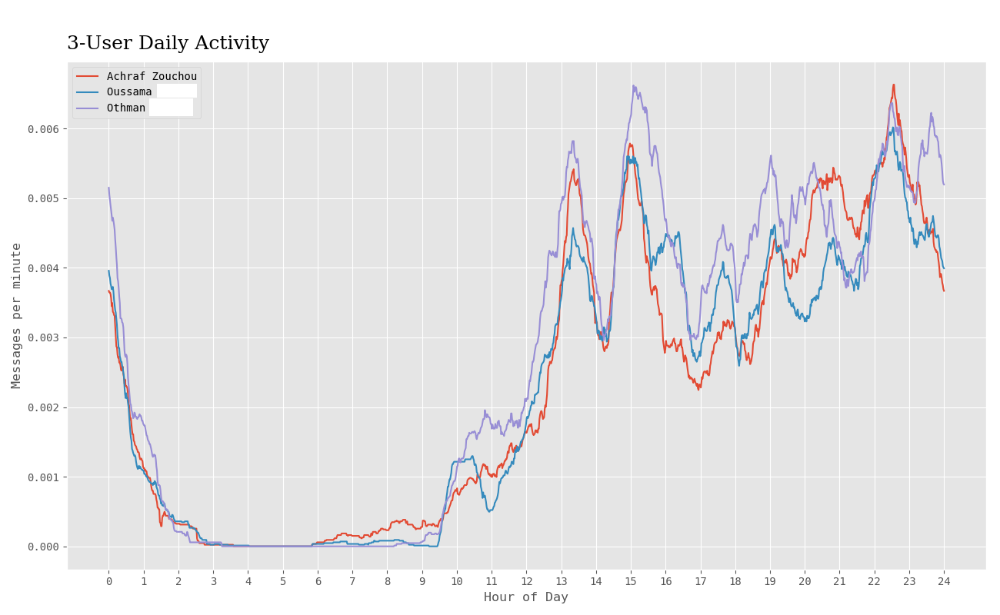
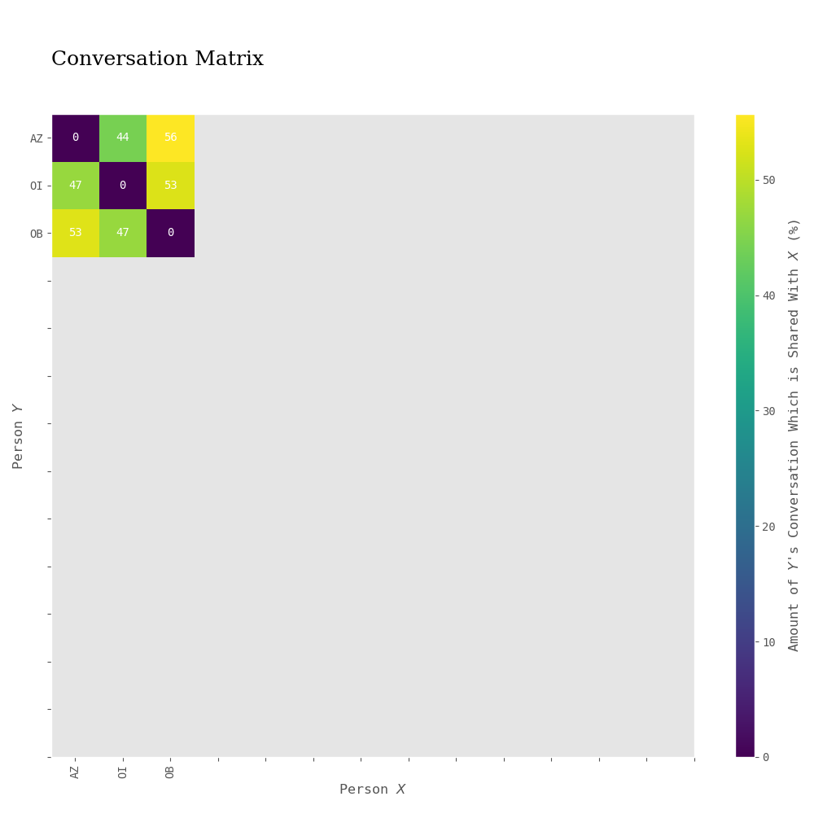
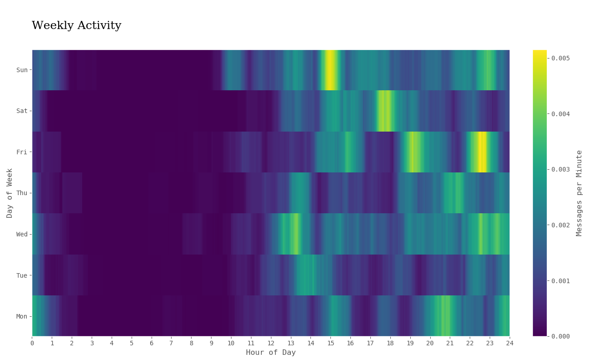
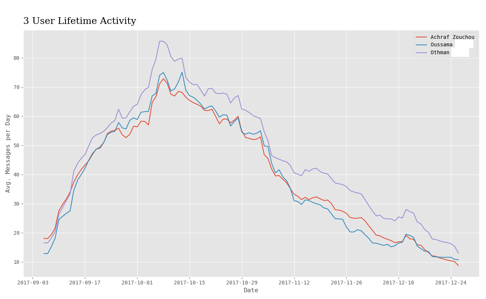

# whatsapp_analyse
Take a chat from whatsapp and parse it, to analyse it afterwards

#  Results example:

How to use:

go to a conversation in whatsapp and click on the 3 dots on the upper right.

afterwards click on 'email chat' and enter your email adress

go to your email and download the chat.

put the 'name_of_the_conversation'.txt file in the chat folder.

and in the terminal use:

  python main.py name_of_the_conversation -all
  
and the result will be created on a folder named result
